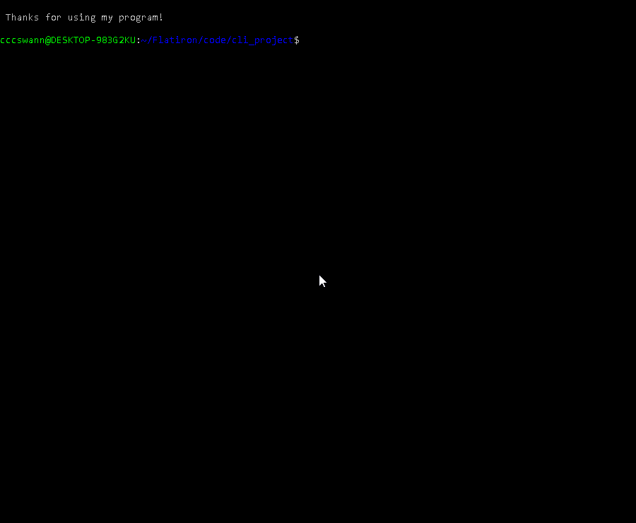

# League of Legends: Champion Catalogue - CLI Project

An interactive CLI tool for finding basic information and stats on the 152 playable champions in the MOBA (Multiplayer Online Battle Arena) game, League of Legends.

## Getting Started
Clone this project into your local machine and follow the instructions below:

### Installation 
After cloning:
* Install the gems required: `bundle install`
* To start, run the following command from the project folder: `./bin/start`

This application is not endorsed, certified or otherwise approved in any way by Riot Games, Inc. or any of its affiliates.
